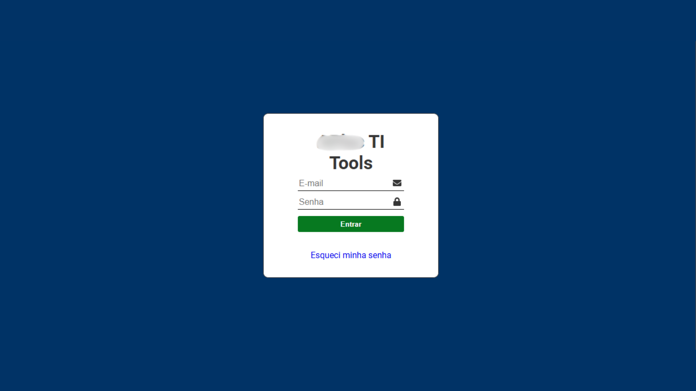
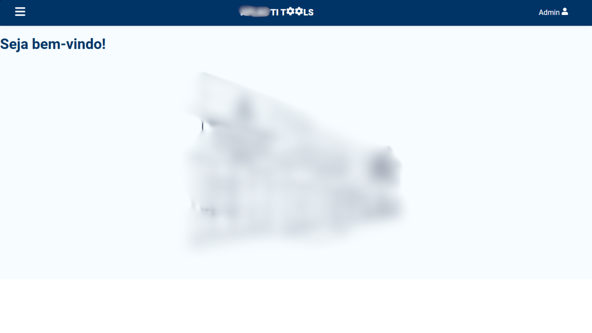
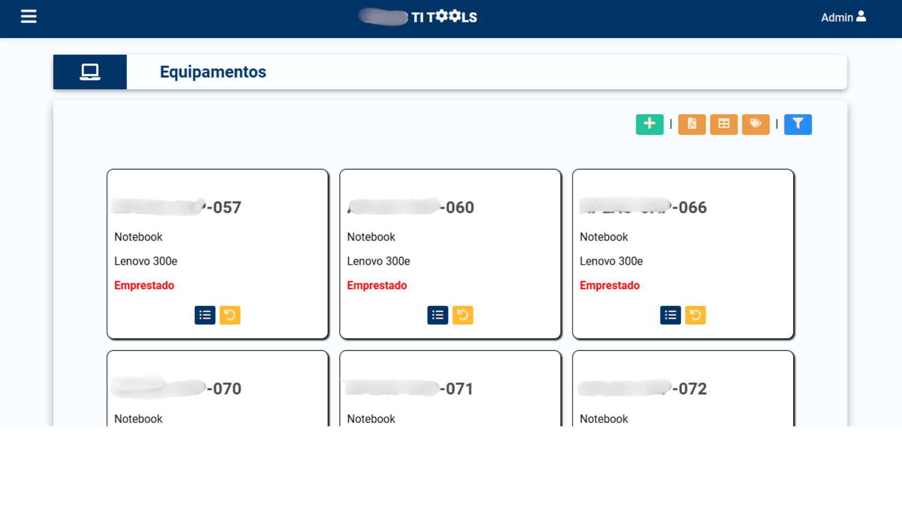
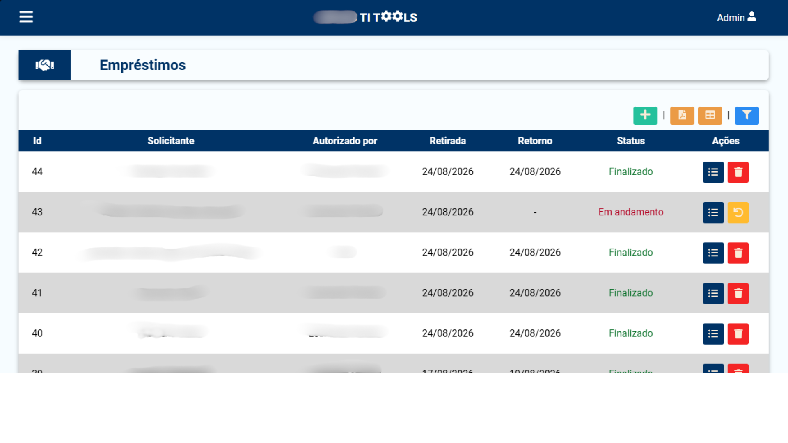
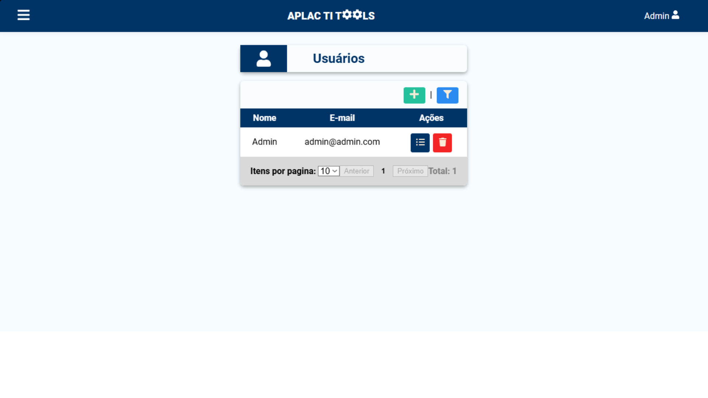
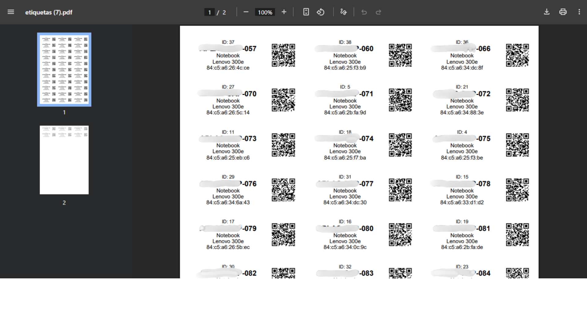
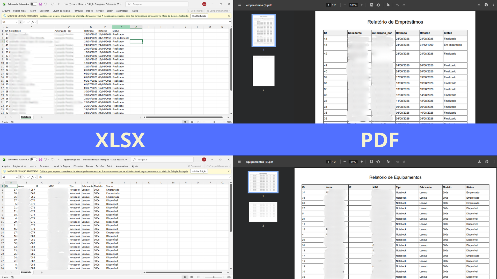

# TiTools

Sistema web para gerenciamento de empréstimos de equipamentos de tecnologia, desenvolvido para auxiliar a equipe de TI de uma instituição de ensino no controle de notebooks utilizados para atividades acadêmicas.

> **Projeto real em operação:** o TiTools foi desenvolvido para solucionar um problema recorrente relacionado ao controle e extravio de equipamentos. Antes de sua implementação, ocorria, em média, o extravio de aproximadamente um equipamento por ano. Após a implementação do sistema, não foram registrados novos casos de extravio.

---

## 📌 Sobre o projeto

O **TiTools** é uma aplicação desenvolvida para centralizar e organizar o processo de empréstimo de equipamentos tecnológicos dentro de uma escola.

O sistema é utilizado pelos responsáveis pela área de TI para registrar equipamentos, controlar empréstimos, acompanhar usuários e gerar informações relacionadas aos equipamentos e às movimentações realizadas.

Embora o sistema seja utilizado diretamente pela equipe de TI, seu funcionamento impacta todos os usuários que solicitam equipamentos para utilização acadêmica.

O projeto é composto por duas aplicações independentes:

* **Backend:** API REST desenvolvida com ASP.NET Core.
* **Frontend:** aplicação web desenvolvida com React.js e Vite.

### Repositórios

* **Backend:** https://github.com/leosilva1999/titoolsapi
* **Frontend:** https://github.com/leosilva1999/titoolsweb

---

## ✨ Funcionalidades

* 🔐 Autenticação e autorização de usuários
* 💻 Cadastro e gerenciamento de equipamentos
* 📦 Controle de empréstimos
* 👥 Gestão de usuários
* 🏷️ Impressão de etiquetas para identificação dos equipamentos
* 📊 Exportação de relatórios de equipamentos
* 📋 Exportação de relatórios de empréstimos
* ❤️ Monitoramento da disponibilidade da API e do banco de dados através de Health Checks

---

## 🖥️ Screenshots

### Login



### Página inicial



### Equipamentos



### Empréstimos



### Usuários



### Impressão de etiquetas



### Relatórios



---

## 🏗️ Arquitetura

O backend foi desenvolvido utilizando uma arquitetura em camadas, separando as responsabilidades da aplicação entre Controllers, Services e Repositories.

```text
                    ┌──────────────────────┐
                    │   React + Vite       │
                    │      Frontend        │
                    └──────────┬───────────┘
                               │
                               │ HTTP / REST
                               ▼
                    ┌──────────────────────┐
                    │ ASP.NET Core Web API │
                    └──────────┬───────────┘
                               │
                  ┌────────────┴────────────┐
                  │                         │
                  ▼                         ▼
          ┌──────────────┐          ┌──────────────┐
          │  Services    │          │    DTOs      │
          └──────┬───────┘          └──────────────┘
                 │
                 ▼
          ┌──────────────┐
          │ Repositories │
          └──────┬───────┘
                 │
                 ▼
          ┌──────────────┐
          │ Entity       │
          │ Framework    │
          │ Core         │
          └──────┬───────┘
                 │
                 ▼
          ┌──────────────┐
          │   MySQL 8    │
          └──────────────┘
```

A aplicação utiliza **Dependency Injection** para gerenciar os serviços e repositórios.

Entre os principais componentes estão:

```text
Controllers/
DTOs/
Models/
Context/
Repositories/
Services/
Migrations/
```

---

## 🔐 Autenticação e autorização

A autenticação da API utiliza **ASP.NET Core Identity** em conjunto com **JWT Bearer Authentication**.

O sistema possui três níveis de acesso:

* `user`
* `admin`
* `superadmin`

Também são utilizadas políticas de autorização para controlar o acesso aos diferentes recursos da aplicação.

Entre as políticas implementadas estão:

* `UserOnly`
* `AdminOnly`
* `SuperAdminOnly`
* `ExclusiveOnly`

Os tokens JWT possuem validação de:

* Issuer
* Audience
* Lifetime
* Signing Key

O frontend envia o token através do header HTTP:

```http
Authorization: Bearer <token>
```

---

## 🛠️ Tecnologias utilizadas

### Backend

| Tecnologia                       | Utilização                  |
| -------------------------------- | --------------------------- |
| C#                               | Linguagem principal         |
| .NET 8                           | Plataforma                  |
| ASP.NET Core Web API             | Construção da API REST      |
| Entity Framework Core 8          | ORM                         |
| Pomelo.EntityFrameworkCore.MySql | Integração EF Core/MySQL    |
| MySQL 8                          | Banco de dados              |
| ASP.NET Core Identity            | Gerenciamento de identidade |
| JWT Bearer                       | Autenticação                |
| Swagger / OpenAPI                | Documentação da API         |
| Health Checks                    | Monitoramento da aplicação  |

### Frontend

| Tecnologia     | Utilização                          |
| -------------- | ----------------------------------- |
| React 18       | Interface da aplicação              |
| Vite           | Build e desenvolvimento             |
| Redux Toolkit  | Gerenciamento de estado             |
| React Router   | Roteamento                          |
| React PDF      | Geração de documentos PDF           |
| QRCode         | Geração de QR Codes                 |
| XLSX           | Manipulação/exportação de planilhas |
| React Select   | Componentes de seleção              |
| React Toastify | Notificações                        |
| date-fns       | Manipulação de datas                |
| React Icons    | Ícones                              |

### Infraestrutura e ferramentas

* Docker
* Docker Compose
* Git
* GitHub
* GitHub Actions
* Terraform
* AWS EC2
* AWS ECS
* AWS S3

---

## 🐳 Docker

O backend possui uma imagem Docker construída utilizando **multi-stage build**.

O `docker-compose.yml` disponibiliza dois serviços:

```text
┌──────────────────────┐
│      API             │
│  ASP.NET Core 8      │
│      :8080           │
└──────────┬───────────┘
           │
           ▼
┌──────────────────────┐
│      MySQL 8         │
│      :3306            │
└──────────────────────┘
```

O banco possui um health check e a API depende da disponibilidade do MySQL para iniciar.

O banco também utiliza um volume Docker para persistência dos dados.

### Executando com Docker

Com Docker e Docker Compose instalados:

```bash
docker compose up --build
```

Após a inicialização:

```text
API:
http://localhost:8080

Health Check:
http://localhost:8080/health

Health Dashboard:
http://localhost:8080/dashboard
```

O MySQL fica disponível externamente através da porta:

```text
localhost:3307
```

### Configuração

Por questões de segurança, **não são disponibilizadas neste README senhas, chaves JWT ou outras credenciais utilizadas pelo ambiente real**.

As configurações devem ser fornecidas através das variáveis de ambiente correspondentes.

Principais configurações utilizadas:

```text
ASPNETCORE_ENVIRONMENT
ASPNETCORE_URLS
ADMIN_PASSWORD
ConnectionStrings__MySqlConnection
JwtTest__ValidIssuer
JwtTest__ValidAudience
JwtTest__SecretKey
```

---

## 💻 Executando localmente

### Pré-requisitos

Para executar o backend localmente, é necessário possuir:

* [.NET 8 SDK](https://dotnet.microsoft.com/)
* MySQL 8
* Entity Framework Core CLI
* Git

Para o frontend:

* Node.js
* npm

---

## ⚙️ Backend

Clone o repositório:

```bash
git clone https://github.com/leosilva1999/titoolsapi.git
```

Entre no diretório:

```bash
cd titoolsapi
```

Restaure as dependências:

```bash
dotnet restore
```

Compile o projeto:

```bash
dotnet build
```

Configure a conexão com o banco de dados e as configurações necessárias no ambiente de desenvolvimento.

Em desenvolvimento, as migrations precisam ser aplicadas manualmente:

```bash
dotnet ef database update
```

Execute a aplicação:

```bash
dotnet run
```

---

## 🌐 Frontend

O frontend está disponível em um repositório separado:

https://github.com/leosilva1999/titoolsweb

Clone o projeto:

```bash
git clone https://github.com/leosilva1999/titoolsweb.git
```

Entre no diretório:

```bash
cd titoolsweb
```

Instale as dependências:

```bash
npm install
```

Execute a aplicação:

```bash
npm run dev
```

A URL da API consumida pelo frontend é definida no arquivo `config.jsx`.

Exemplo:

```javascript
export const api = "http://localhost:8080/api";
```

Em ambientes específicos, o endereço da API pode ser alterado conforme a configuração utilizada.

---

## 🗄️ Banco de dados e migrations

O projeto utiliza **Entity Framework Core Migrations** para versionamento da estrutura do banco de dados.

Em ambiente de desenvolvimento, as migrations podem ser aplicadas através de:

```bash
dotnet ef database update
```

Em produção, o backend executa automaticamente:

```csharp
db.Database.Migrate();
```

durante a inicialização da aplicação.

A inicialização também possui um mecanismo de retry para lidar com situações em que o banco ainda não esteja disponível.

No ambiente Docker, isso trabalha em conjunto com o health check do container MySQL, permitindo que a API aguarde o banco estar disponível antes de continuar sua inicialização.

---

## ❤️ Health Checks

A aplicação possui monitoramento integrado através do ASP.NET Core Health Checks.

### Health Check da API

```text
/health
```

### Dashboard

```text
/dashboard
```

O Health Check inclui uma verificação da conexão com o banco de dados MySQL.

Essa funcionalidade permite identificar rapidamente problemas relacionados à disponibilidade da aplicação ou do banco de dados.

---

## 🧪 Testes

O projeto possui uma estrutura inicial de testes automatizados utilizando:

* xUnit
* NSubstitute

Atualmente, a suíte de testes ainda está em desenvolvimento e não possui uma meta mínima de cobertura definida.

O objetivo é ampliar progressivamente a cobertura das principais regras de negócio da aplicação.

---

## 📁 Estrutura do backend

```text
TiTools_backend/
├── .github/
│   └── workflows/
├── Context/
├── Controllers/
├── DTOs/
├── Migrations/
├── Models/
├── Properties/
│   └── PublishProfiles/
├── Repositories/
├── Services/
├── Dockerfile
├── docker-compose.yml
├── Program.cs
└── TiTools_backend.csproj
```

### Principais responsabilidades

**Controllers**

Responsáveis pelos endpoints HTTP e pela comunicação com os clientes da API.

**Services**

Concentram as regras de negócio da aplicação.

**Repositories**

Responsáveis pelo acesso e manipulação dos dados.

**DTOs**

Definem os objetos utilizados na comunicação entre a API e seus consumidores.

**Models**

Representam as entidades e modelos utilizados pela aplicação.

**Context**

Contém a configuração do Entity Framework Core e do acesso ao banco de dados.

**Migrations**

Versionam as alterações estruturais realizadas no banco de dados.

---

## 📊 Status do projeto

O escopo principal do TiTools está **concluído**.

A aplicação encontra-se em operação em uma escola da rede e atualmente passa principalmente por:

* correções de bugs;
* ajustes pontuais;
* manutenção.

Não existe um roadmap de novas funcionalidades definido neste momento.

---

## 📚 Conhecimentos desenvolvidos

O desenvolvimento do TiTools proporcionou experiência prática em diversas áreas do desenvolvimento de software, incluindo:

* ASP.NET Core Web API
* C#
* Entity Framework Core
* MySQL
* ASP.NET Core Identity
* JWT
* Arquitetura em camadas
* Repository Pattern
* Dependency Injection
* React
* Redux Toolkit
* Integração entre frontend e backend
* Docker
* Docker Compose
* Testes unitários
* GitHub Actions
* Terraform
* AWS EC2
* AWS ECS
* AWS S3

Além do aprendizado técnico, o projeto proporcionou experiência no desenvolvimento de uma solução utilizada em um ambiente real, incluindo levantamento de necessidades, implementação, implantação e manutenção.

---

## 🎯 Resultado

Um dos principais objetivos do TiTools era melhorar o controle sobre os equipamentos emprestados e reduzir ocorrências de extravio.

Antes da implementação do sistema, ocorria aproximadamente **um extravio de equipamento por ano**.

Após a implementação do TiTools, **não foram registrados novos casos de extravio** no ambiente em que o sistema foi implantado.

Esse resultado demonstra o impacto prático da aplicação para além de seus aspectos técnicos, auxiliando a equipe responsável pela TI no controle e rastreabilidade dos equipamentos.

---

## 👨‍💻 Autor

**Leonardo Pereira**
Desenvolvedor .NET

* GitHub: https://github.com/leosilva1999
* LinkedIn: https://www.linkedin.com/in/leonardo-pereira-da-silva-67399b191
* E-mail: [leopereirasilva86@gmail.com](mailto:leopereirasilva86@gmail.com)

---

## 📄 Licença

Este projeto não possui uma licença de código aberto definida atualmente.
